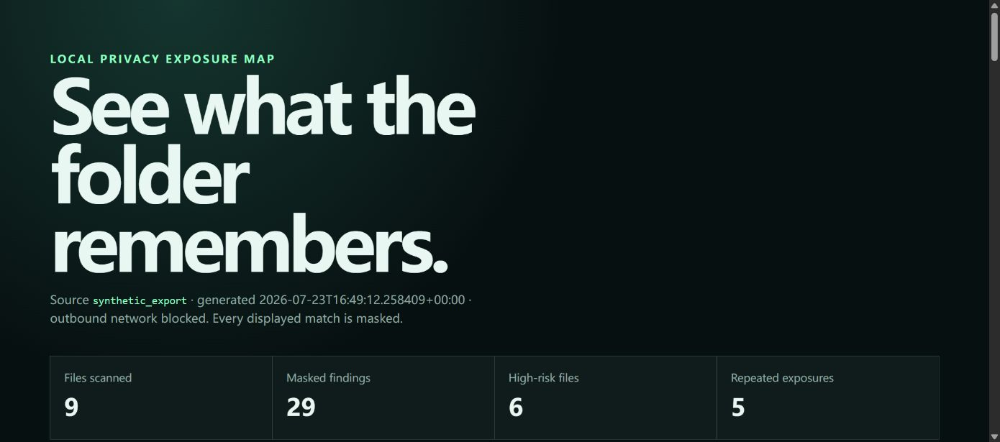

# Data XRay Local

> A completely local folder and export-package privacy audit: find what personal data is exposed,
> where it repeats, and what to clean first—without uploading source files.

[](https://github.com/KanadeK/data-xray-local/actions/workflows/ci.yml)
[](https://github.com/KanadeK/data-xray-local/releases/tag/v0.1.0)
[](LICENSE)

[简体中文](README.zh-CN.md) · Current status: **v0.1.0**



Data XRay Local is for journalists, lawyers, developers, and privacy-sensitive people preparing a
folder for disclosure, archiving, or handoff.

- **One exposure map:** text, CSV, JSON, Office Open XML content/metadata, and common image EXIF.
- **Useful without retaining secrets:** reports keep relative paths, categories, counts, and masked
  fragments—not complete matches or absolute source paths.
- **Cleanup in context:** file heatmap, cross-file duplicate exposure groups, and prioritized advice.

## Quick start

Python 3.12 is required.

```bash
python -m pip install -e ".[dev]"
data-xray scan ./examples/synthetic_export --output ./reports/first-scan --no-network
```

Open `reports/first-scan/data-xray-report.html`. For the local review interface:

```bash
data-xray serve
# open http://127.0.0.1:8765
```

## Real input → masked output

The committed CC0 sample contains the fictional value `avery.north@example.com` in CSV, JSON,
DOCX, XLSX, and JPEG EXIF. A report finding looks like:

```json
{
  "category": "email",
  "path": "contacts.csv",
  "location": "table · row 2, column 2 · line 1, column 1",
  "masked_fragment": "a•••@e•••.com",
  "duplicate_group": "dup-001"
}
```

The full address is used only transiently for matching. It is not written to JSON or HTML.

## Features

### Supported inputs

| Input | Inspection |
|---|---|
| TXT, Markdown, logs, config | UTF-8/UTF-16 text rules |
| CSV, TSV | Cell-level locations |
| JSON | Deterministic JSON-path locations |
| DOCX, PPTX | OOXML text plus creator and modifier metadata |
| XLSX | Cell values plus workbook properties |
| JPEG, PNG, TIFF, WebP | Pillow-readable EXIF, including GPS and authorship |

The transparent rules detect email, phone, English and Chinese street-address shapes, US SSN and
Chinese resident-ID shapes, AWS/GitHub/JWT/generic assigned credentials, and Luhn-valid payment
cards. Detection is heuristic and intentionally explainable.

### Outputs

- Sanitized JSON for review tooling.
- A self-contained, responsive HTML report with no remote assets.
- File risk heatmap and severity filtering.
- Numbered repeated-exposure groups that never persist equality hashes.
- Category-specific cleanup order.

## Non-goals

- This is not legal advice, compliance certification, malware detection, OCR, or proof that a
  folder is safe.
- v0.1.0 does not alter, delete, redact, or upload source files.
- It does not inspect legacy binary Office formats, PDFs, archives, video, or audio.
- It favors deterministic transparent rules over a downloaded language model.

## Architecture

```text
local file source
  → format adapters (text / table / OOXML / EXIF)
  → pure detector + ephemeral equality digests
  → risk, repeat, and recommendation aggregation
  → sanitized report model
  → CLI / loopback FastAPI / JSON + standalone HTML
```

The domain layer imports neither FastAPI nor Typer. File extraction and network blocking are
adapters. The CLI and Web UI invoke the same `ScannerService`. See
[docs/ARCHITECTURE.md](docs/ARCHITECTURE.md).

## CLI

```text
data-xray scan TARGET [--output PATH] [--no-network] [--fail-on SEVERITY]
data-xray demo [--output PATH] [--sample PATH]
data-xray serve [--host 127.0.0.1] [--port 8765]
data-xray version
```

`--fail-on high` returns exit code `10` when a high or critical finding exists. Invalid input and
read failures return `2`. The default scan guard blocks DNS resolution and common outbound socket
helpers. The browser interface communicates only with the loopback FastAPI process.

## API and interface

`POST /api/scan` accepts a local target path and local output path:

```json
{
  "target": "examples/synthetic_export",
  "output": "reports/web",
  "no_network": true
}
```

The response contains the sanitized report and artifact filenames, never the absolute target path.
Interactive API documentation is disabled because common Swagger UI setups load remote assets.
The root page is keyboard-usable, responsive, uses live status announcements, and honors reduced
motion.

## Sample data

`examples/synthetic_export/` is deterministic, fictional, and licensed CC0-1.0. It contains CSV,
JSON, text, DOCX, XLSX, and a JPEG with synthetic EXIF. `MANIFEST.json` records hashes and
explicitly states that it contains no real personal data.

Regenerate the binary fixtures only when intentionally updating them:

```bash
python scripts/generate_sample_data.py
python scripts/demo.py
```

## Privacy and security

- Scanning is read-only and does not follow symlinked directories.
- Source root and absolute paths are not stored in reports.
- Serializable models have no raw-match field.
- Duplicate comparison digests exist only in process memory and become opaque `dup-NNN` labels.
- Reports use escaped content and a restrictive Content Security Policy.
- Native file parsing is bounded by a configurable size limit; unsupported files are visible as
  skipped, never silently treated as safe.

Read the full threat model in [docs/PRIVACY_AND_SECURITY.md](docs/PRIVACY_AND_SECURITY.md). Report
vulnerabilities according to [SECURITY.md](SECURITY.md).

## Testing and reproducibility

```bash
python -m pip install -e ".[dev]"
python -m ruff check .
python -m ruff format --check .
python -m mypy src
python -m pytest -q --cov=src --cov-report=term-missing --cov-fail-under=80
python -m build

make verify
make demo
make package
make release-check
```

Windows systems without `make` use the equivalent `scripts/*.ps1` or the portable Python scripts:

```powershell
python scripts/verify.py
python scripts/demo.py
python -m build
python scripts/package_release.py
python scripts/release_check.py
```

Tests cover domain rules, state aggregation, parser errors, real synthetic formats, privacy
leakage, the no-network gate, CLI paths, and the FastAPI interface. Benchmark evidence is in
[docs/BENCHMARK.md](docs/BENCHMARK.md).

## Packaging and releases

`python scripts/package_release.py` assembles wheel, sdist, launch scripts/sample bundle, sanitized
sample reports, and `SHA256SUMS.txt` in `dist-release/`. It installs the wheel into a clean
temporary target and imports the packaged application before succeeding.

`python scripts/release_check.py` additionally requires a clean `main`, consistent v0.1.0
metadata, passing tests, expected artifacts, no empty implementation markers, synthetic-only
credential shapes, and a single `KanadeK` author/committer identity.

## Competitive difference

An initial public GitHub repository sample found adjacent PII engines, secret scanners, upload
sanitizers, database catalog scanners, and EXIF readers. The sampled search found no active project
with the same name and a highly isomorphic combination. Data XRay Local stays narrower than a
sanitizer and broader than a detector library: it explains cross-format, cross-file privacy
exposure while keeping the source untouched. See [docs/COMPETITOR_SCAN.md](docs/COMPETITOR_SCAN.md)
for the dated evidence and limitations of that claim.

## Roadmap

- v0.2: optional PDF text/OCR adapter with the same no-network and masked-report guarantees.
- v0.3: user-authored local rule packs and confidence tuning.
- Later: signed desktop bundles after platform-specific security review.

## Contributing

Read [CONTRIBUTING.md](CONTRIBUTING.md) and submit synthetic fixtures only. New detectors need
positive, negative, privacy-leak, and report serialization tests.

## FAQ

### Does a clean report mean a folder is safe?

No. Unsupported formats, novel identifier shapes, context-dependent facts, and steganography can
still contain private data. Use the report to focus human review.

### Does the Web UI upload files?

No. It sends the typed local path to the loopback process. The server reads that local path and
writes a local report. Bind to `127.0.0.1` unless you deliberately accept LAN exposure.

### Why not automatically delete or sanitize files?

For journalists and legal workflows, destructive cleanup can break provenance. v0.1.0 is advisory
and read-only; users create their own reviewed disclosure copy.

### Why are only fragments shown?

Showing complete matches in the report would turn the audit artifact into another privacy leak.

## License

Code is [MIT licensed](LICENSE). The synthetic sample export is dedicated under CC0-1.0.

